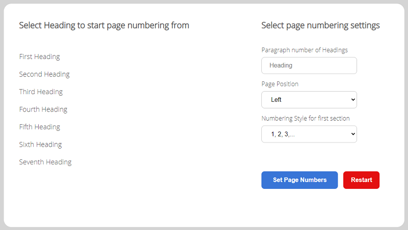

# start_page_numbers_at_X
Easily number word docs

## About this project
This application was designed to make the process of selecting the page to begin numbering a word document much simpler, as Microsoft Word does not provide a straightforward method to achieve this.

The word documents are edited using the python-docx [python-docx](https://python-docx.readthedocs.io/en/latest/) library to manipulate the word documents XML files. The Backend of the webserver has been served using the [Django](https://www.djangoproject.com/) Web Frame Work. The frontend was written with minimal JavaScript and jQuery.

## Application Instructions 
Before using this application you will be required to have a word document in .docx format. Word documents with Heading 1 headings are required, as it is not possible to determine the page numbers in python docx as it will change when rendered.


<p align="center">
  
</p>

The first option that is required is to choose the heading  as seen above on the left hand side, which will start the new section. This will place the paragraph number corresponding to the selected heading into the input box with the label “Paragraph number of Headings”

The Options seen above on the right hand side are optional 
The position option denotes where on the page the numbering will be either left, center or right.

The final option allows the user to specify the numbering style that will appear in the first section of the word document, these styles include Roman Numerals and Upper-case letters.

Once the user is satisfied, they can then submit the document to be numbered.
After the file has been processed the numbered word file is returned to the user to be downloaded.

### Numbering Process
Heading 1 was chosen for this application as it typically is used to start a new page. If no headings are used then it may be more sutable to implement  lastRenderedPageBreak in order to find a suitable place to add a section break.

# Running Locally
In order to run this application locall you  follow these steps.

Clone the repository using Git 

```bash
git clone https://github.com/seddie95/start_page_numbers_at_X.git
```

Create a new python environment and install the dependencies
```bash
pip install -r requirements.txt
```
Once Django has been installed successfully migrate the model data to the sqlite3 database
```bash
python manage.py makemigrations
python manage.py migrate
```
After successful migration start the django server 
```bash
python manage.py runserver
```
Then open the site at http://127.0.0.1:8000/
